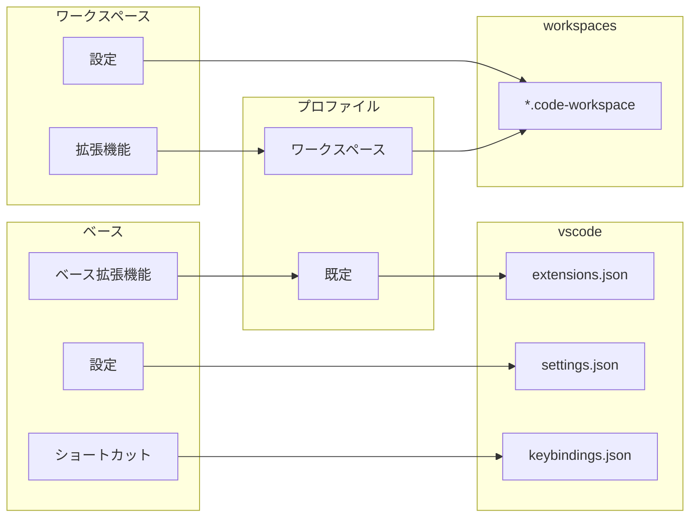

# vscode

## 方針

- テキストで管理できるようにする
  - バージョン管理するため
- プロジェクト毎に設定や拡張機能を切り替えられるようにする
  - 使う言語やツール・サービスが異なるため

## 依存関係

```mermaid
graph LR
  subgraph vscode
    extensions.json
    settings.json
    keybindings.json
  end
  subgraph workspaces
    *.code-workspace
  end
  subgraph プロファイル
    既定
    ワークスペースプロファイル[ワークスペース]
  end
  subgraph ベース
    ベース設定[設定]
    ベース拡張機能
    ショートカット
  end
  subgraph ワークスペース
    ワークスペース設定[設定]
    ワークスペース拡張機能[拡張機能]
  end

  ベース設定 --> settings.json
  ベース拡張機能 --> 既定 --> extensions.json
  ショートカット --> keybindings.json

  ワークスペース設定 --> *.code-workspace
  ワークスペース拡張機能 --> ワークスペースプロファイル --> *.code-workspace
```
